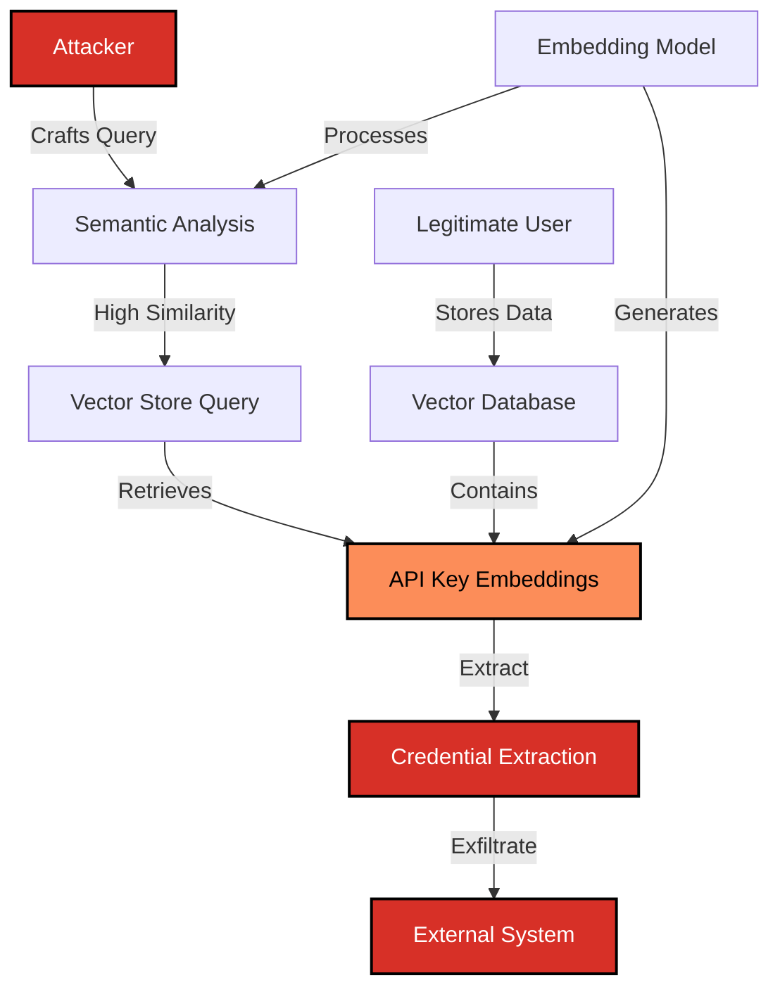

# SAFE-T1505: In-Memory Secret Extraction

## Overview
**Tactic**: Credential Access (ATK-TA0006), Exfiltration (ATK-TA0010)  
**Technique ID**: SAFE-T1505  
**Severity**: Critical  
**First Observed**: Research-based threat (2024-2025)  
**Last Updated**: 2026-04-14  
**Author**: Sumit Yadav (rockerritesh4@gmail.com)

## Description
In-Memory Secret Extraction is an attack technique that exploits the semantic understanding capabilities of embedding models and vector databases to identify, extract, and exfiltrate API keys and other credentials from AI systems. Unlike traditional pattern-matching approaches, this technique leverages the semantic similarity between prompts and stored embeddings to circumvent standard security controls.

Attackers exploit the fact that modern LLM systems use embedding models (such as Word2Vec, BERT, or sentence transformers) to convert text into high-dimensional vector representations. The threat model is that, by crafting queries with high semantic similarity to credential-related content, adversaries can retrieve or infer API keys from vector stores, prompt caches, or model contexts without triggering keyword-based detection systems. Direct end-to-end credential extraction from MCP-integrated stores has not been demonstrated in the open literature as of this writing; the technique describes a credible threat assembled from primitives that have been independently demonstrated (embedding-layer perturbation, prompt-cache timing side-channels, system-prompt extraction). See "Current Status" below for the specific evidence base.

## Attack Vectors

### Primary Vector: Semantic Similarity Exploitation
- **Method**: Craft prompts with high semantic similarity to API key queries
- **Prerequisites**: Understanding of embedding models and vector similarity metrics
- **Persistence**: Queries can bypass traditional keyword filters
- **Detection Difficulty**: High - semantically similar but lexically different from known patterns

### Secondary Vectors

#### 1. Vector Store Query Manipulation
- **Target**: ChromaDB, Pinecone, Weaviate, FAISS, or other vector databases
- **Method**: Submit queries designed to retrieve embeddings containing credentials
- **Exploitation**: Use cosine similarity or other distance metrics to locate sensitive information
- **Impact**: Systematic extraction of stored API keys

#### 2. Activation Embedding Analysis
- **Target**: Neural network activation layers
- **Method**: Analyze activation patterns to identify credential-containing contexts
- **Prerequisites**: Access to model internals or activation outputs
- **Sophistication**: Requires ML expertise

#### 3. Prompt Caching Exploitation
- **Target**: Cached prompts that may contain API keys
- **Method**: Query semantically similar prompts to trigger cache hits and observe timing or shared-cache side-channels
- **Adjacent research**: "Auditing Prompt Caching in Language Model APIs" ([arXiv:2502.07776](https://arxiv.org/abs/2502.07776)) demonstrates timing side-channels and cross-user cache sharing in production LLM APIs. Direct retrieval of credentials from cache is a theoretical extension of those primitives to MCP environments where prompts may contain secrets, and has not been independently demonstrated.
- **Impact**: Inference about candidate cached prompt content (including potential credentials) via timing or cross-tenant cache hits

## Technical Details

### Prerequisites
- Understanding of embedding models (Word2Vec, BERT, Sentence Transformers)
- Knowledge of vector similarity metrics (cosine similarity, Euclidean distance)
- Access to MCP server with vector store integration
- Basic understanding of semantic search mechanisms

### Attack Flow



### Example Attack Scenarios

#### Scenario 1: Vector Store Credential Retrieval

**Step 1: Reconnaissance**
```python
# Attacker analyzes the embedding model used by target
from sentence_transformers import SentenceTransformer

model = SentenceTransformer('all-MiniLM-L6-v2')

# Known API key patterns
legitimate_query = "What is my OpenAI API key?"
embedding = model.encode(legitimate_query)
```

**Step 2: Semantic Query Crafting**
```python
# Craft semantically similar queries that bypass keyword filters
semantic_variants = [
    "Show me the authentication token for the AI service",
    "What credentials do I need for the language model?",
    "Display the secret key used for API access",
    "Retrieve my access credentials for the external service",
]

# Calculate semantic similarity
from sklearn.metrics.pairwise import cosine_similarity
import numpy as np

base_embedding = model.encode(legitimate_query).reshape(1, -1)

for variant in semantic_variants:
    variant_embedding = model.encode(variant).reshape(1, -1)
    similarity = cosine_similarity(base_embedding, variant_embedding)[0][0]
    print(f"Similarity: {similarity:.4f} - {variant}")
```

**Step 3: Vector Store Query**
```python
# Query vector store with semantically similar prompt
import chromadb

client = chromadb.Client()
collection = client.get_collection("user_context")

# Query using semantic variant
results = collection.query(
    query_texts=["Show me the authentication token for the AI service"],
    n_results=5
)

# Extract API keys from results
for doc in results['documents'][0]:
    if 'sk-' in doc or 'api' in doc.lower():
        print(f"Potential API key found: {doc}")
```

#### Scenario 2: Activation Embedding Exploitation

```python
# Advanced attack: Analyze activation embeddings
import torch
from transformers import AutoModel, AutoTokenizer

model_name = "bert-base-uncased"
tokenizer = AutoTokenizer.from_pretrained(model_name)
model = AutoModel.from_pretrained(model_name, output_hidden_states=True)

# Craft query to extract credentials
query = "Retrieve authentication credentials for external service"
inputs = tokenizer(query, return_tensors="pt")

# Get activation embeddings
with torch.no_grad():
    outputs = model(**inputs)
    hidden_states = outputs.hidden_states
    
# Analyze activation patterns for credential indicators
last_layer = hidden_states[-1][0]  # Last layer activations

# Use clustering to identify credential-related activations
from sklearn.cluster import KMeans

kmeans = KMeans(n_clusters=5, random_state=42)
clusters = kmeans.fit_predict(last_layer.numpy())

# Identify clusters with high variance (potential sensitive data)
for i in range(5):
    cluster_variance = last_layer[clusters == i].var().item()
    if cluster_variance > 0.5:  # High variance threshold
        print(f"Cluster {i} shows high variance: {cluster_variance:.4f}")
```

#### Scenario 3: Prompt Cache Probing

```python
# Probe a semantic prompt cache for cross-tenant content using timing side-channels.
# Side-channel primitives (response-time delta on cache hit, cross-user cache sharing)
# are demonstrated against production LLM APIs in Gu et al., "Auditing Prompt Caching
# in Language Model APIs" (arXiv:2502.07776). The paper does NOT demonstrate that
# cached responses themselves contain extractable credentials; this scenario shows
# how the timing primitive could be applied in an MCP environment, with a hypothetical
# extension (response-body credential matching) that would only succeed if the deployment
# actually returns or echoes credential-bearing cached prompts to the caller.
import time

CACHE_HIT_LATENCY_DELTA_MS = 50  # tune per deployment

def probe_prompt_cache(target_api_endpoint):
    cache_trigger_queries = [
        "What authentication method should I use?",
        "How do I configure API access?",
        "Show example of API key configuration",
        "What are my service credentials?",
    ]

    for query in cache_trigger_queries:
        baseline_ms = measure_cold_query_latency(target_api_endpoint, query)
        t0 = time.perf_counter()
        response = send_query(target_api_endpoint, query)
        elapsed_ms = (time.perf_counter() - t0) * 1000

        likely_cache_hit = (baseline_ms - elapsed_ms) > CACHE_HIT_LATENCY_DELTA_MS
        if likely_cache_hit:
            log_cache_hit_signal(query, elapsed_ms, baseline_ms)

            # Hypothetical MCP-specific extension: if the deployment echoes cached
            # prompt content into responses, response-body credential matching could
            # turn a cache-hit signal into a credential leak. This is NOT demonstrated
            # by the cited paper, and is only meaningful conditional on a cache hit.
            if contains_api_key_pattern(response):
                flag_for_review(query, response)

def contains_api_key_pattern(text):
    """Detect API key patterns in response"""
    patterns = [
        r'sk-[a-zA-Z0-9]{32,}',     # OpenAI
        r'AKIA[0-9A-Z]{16}',         # AWS
        r'AIza[0-9A-Za-z\-_]{35}',  # Google
        r'ya29\.[0-9A-Za-z\-_]+',   # Google OAuth
    ]
    import re
    for pattern in patterns:
        if re.search(pattern, text):
            return True
    return False
```

### Advanced Attack Techniques (2024-2025 Research)

According to recent research on embedding security and prompt manipulation, attackers have developed the following variations:

#### 1. Embedding-Layer Perturbation as a Building Block
"Embedding Poisoning: Bypassing Safety Alignment via Embedding Semantic Shift" ([arXiv:2509.06338](https://arxiv.org/abs/2509.06338)) demonstrates that imperceptible perturbations injected into the embedding layer of an aligned LLM can bypass safety guardrails without modifying weights or visible input. The paper targets safety-alignment bypass on aligned models; it does not poison vector stores or target credential storage directly.

The relevance to credential extraction in MCP environments is theoretical: the same primitive — perturbing or crafting embeddings to evade semantic filters — could in principle be applied to:

- Bypass embedding-based credential filters that classify queries by semantic similarity to known credential-extraction patterns
- Construct queries whose embeddings sit just inside a vector-store retrieval threshold for credential-bearing chunks while sitting outside the lexical or keyword filter

```python
def create_perturbed_query_embedding(target_embedding, perturbation):
    """
    Illustrative analogue of the embedding-layer perturbation primitive from
    Yuan et al. (arXiv:2509.06338). NOT a faithful reproduction of their attack,
    which targets the LLM's embedding layer in-process. Shown here only to make
    the threat model concrete for MCP environments.
    """
    perturbed = 0.7 * target_embedding + 0.3 * perturbation
    perturbed = perturbed / np.linalg.norm(perturbed)
    return perturbed
```

#### 2. Prompt Leakage as a Credential-Adjacent Risk
"You Can't Steal Nothing: Mitigating Prompt Leakages in LLMs via System Vectors" ([arXiv:2509.21884](https://arxiv.org/abs/2509.21884)) demonstrates a prompt-leakage attack capable of extracting system prompts from advanced models (including GPT-4o and Claude 3.5 Sonnet) and proposes SysVec — encoding system prompts as internal representation vectors — as a mitigation. The paper is primarily a defense paper; the attack it demonstrates is system-prompt extraction, not credential extraction.

The relevance to SAFE-T1505 is indirect: in MCP deployments where API keys, OAuth tokens, or other secrets are placed into the system prompt or are otherwise reachable via the same context window, the prompt-leakage primitive demonstrated in the paper becomes a credential-leakage primitive. This is a corollary, not a result the paper claims.

#### 3. Adaptive-Threshold Cache Probing (Theoretical)
"vCache: Verified Semantic Prompt Caching" ([arXiv:2502.03771](https://arxiv.org/abs/2502.03771)) is a defense paper: it proposes an online algorithm to estimate per-prompt similarity thresholds for safe semantic-cache reuse. It does not describe an attack.

The reason it appears here is that any system using per-prompt or adaptive thresholds for semantic-cache retrieval also exposes those thresholds to inference. An attacker who can probe a deployment with controlled inputs may be able to:

- Estimate the effective similarity threshold the cache uses for a given prompt
- Craft semantically similar but lexically different queries that fall inside that threshold
- Increase the probability of returning a cached response that originated from another user's session

This is a hypothesized side-channel built on top of vCache-style adaptive caching, not a result demonstrated in the cited paper.

## Impact Assessment
- **Confidentiality**: Critical - Direct extraction or inference of API keys and credentials
- **Integrity**: High - Compromised credentials enable system manipulation
- **Availability**: Medium - Stolen credentials can be used for resource exhaustion
- **Scope**: Network-wide - Affects all systems sharing vector stores or embedding models

### Current Status (2025-2026)
Security researchers have documented emerging primitives that compose into the threat described here, though end-to-end credential extraction from MCP-integrated vector stores has not been demonstrated in the open literature:
- Prompt-cache timing side-channels and cross-user cache sharing have been measured against production LLM APIs ([arXiv:2502.07776](https://arxiv.org/abs/2502.07776))
- Embedding-layer perturbation has been shown to bypass safety alignment in aligned LLMs ([arXiv:2509.06338](https://arxiv.org/abs/2509.06338))
- System-prompt extraction from advanced models has been demonstrated, with system-vector encoding proposed as a mitigation ([arXiv:2509.21884](https://arxiv.org/abs/2509.21884))
- Vector database security remains an active research area with few deployed mitigations
- MCP servers with vector store integration lack comprehensive embedding security controls

## Detection Methods

### Indicators of Compromise (IoCs)
- Queries with high semantic similarity to credential-related prompts
- Unusual patterns in vector store query logs
- Embeddings with anomalous similarity scores
- Activation patterns indicating credential extraction attempts
- Repeated queries with lexically different but semantically similar content
- Clustering of queries around credential-containing embedding regions

### Detection Rules

**Important**: The following rule is written in Sigma format and contains example patterns only. Attackers continuously develop new injection techniques and obfuscation methods. Organizations should:
- Use AI-based anomaly detection to identify novel attack patterns
- Regularly update detection rules based on threat intelligence
- Implement multiple layers of detection beyond pattern matching
- Consider semantic analysis of prompt embeddings and query patterns

```yaml
# EXAMPLE SIGMA RULE - Not comprehensive
title: In-Memory Secret Extraction
id: a7f3b2c1-89d4-4e2a-bc3d-567890abcdef
status: experimental
description: Detects potential API key exfiltration through semantic embedding manipulation
author: SAFE-MCP Team
date: 2025-11-16
references:
  - https://github.com/safe-mcp/techniques/SAFE-T1505
  - https://arxiv.org/abs/2509.06338
  - https://arxiv.org/abs/2502.07776
logsource:
  product: mcp
  service: vector_store
detection:
  selection_semantic_similarity:
    query_type: 'vector_search'
    semantic_similarity:
      - '>0.85'  # High similarity threshold
    query_context|contains:
      - 'credential'
      - 'authentication'
      - 'token'
      - 'key'
      - 'secret'
  
  selection_embedding_anomaly:
    embedding_cluster_distance: '<0.2'  # Anomalously close to credential cluster
    query_variance: '>0.5'  # High activation variance
  
  selection_cache_exploitation:
    cache_hit: true
    response_contains_credential_pattern: true
    query_semantic_variant: true  # Lexically different, semantically similar
  
  selection_activation_analysis:
    activation_layer_analysis: true
    credential_pattern_detected: true
    cluster_variance: '>0.5'
  
  condition: selection_semantic_similarity or selection_embedding_anomaly or selection_cache_exploitation or selection_activation_analysis

falsepositives:
  - Legitimate API key management queries from authorized users
  - System administration tasks involving credential rotation
  - Development and testing activities with API keys
  - Documentation queries about API authentication

level: critical
tags:
  - attack.credential_access
  - attack.t1552
  - attack.exfiltration
  - attack.t1041
  - safe.t1505
```

### Behavioral Indicators
- Rapid succession of semantically similar queries
- Queries from unusual geographic locations or IP addresses
- Pattern of queries exploring embedding space around credential clusters
- Activation patterns inconsistent with legitimate use cases
- Vector store queries with incrementally adjusted semantic content
- Unusual access patterns to prompt caching systems

## Mitigation Strategies

### Preventive Controls

1. **[SAFE-M-63: Embedding-Based API Key Detection and Filtering](../../mitigations/SAFE-M-63/README.md)**: **PRIMARY MITIGATION** - Real-time semantic analysis of queries using embedding similarity to detect and block credential extraction attempts. Supports both local deployment (e.g., `all-MiniLM-L6-v2`) and API-based solutions (OpenAI, Google, Cohere). See SAFE-M-63 for accuracy and false-positive characteristics under specific test conditions; raw performance numbers should not be quoted out of context.

2. **[SAFE-M-30: Embedding Sanitization and Validation](../../mitigations/SAFE-M-30/README.md)**: Implement comprehensive validation of embeddings before storage to ensure no credential patterns are embedded in vector representations. Use semantic analysis to detect and redact credential-like content.

3. **[SAFE-M-29: Vector Store Integrity Verification](../../mitigations/SAFE-M-29/README.md)**: Cryptographically verify vector store contents and maintain integrity checksums for embeddings. Implement access controls restricting queries to authorized users only.

4. **Semantic Similarity-Based Prompt Rejection**: Implement real-time semantic analysis to reject queries with high similarity (>0.85 cosine similarity) to known credential-extraction patterns. Use embedding models to calculate similarity scores for all incoming queries.

5. **Embedding-Based Credential Filtering**: Scan all prompts and responses using embedding analysis to detect API key patterns. According to "Universal Sentence Encoder" ([arXiv:1803.11175](https://arxiv.org/abs/1803.11175)), sentence-level embeddings can effectively capture semantic meaning for filtering purposes.

6. **Vector Store API Key Sanitization**: Implement pre-storage validation that calculates semantic distance from known credential patterns. Reject embeddings with distance below an empirically chosen threshold (e.g., <0.3 cosine distance) from API-key pattern embeddings; calibrate the threshold against your own data rather than copying a fixed value.

7. **Prompt Cache Security Measures**: Prompt-cache timing side-channels and cross-user cache sharing have been demonstrated against production LLM APIs ("Auditing Prompt Caching in Language Model APIs", [arXiv:2502.07776](https://arxiv.org/abs/2502.07776)), so even if cached entries do not directly expose credentials, cache behavior can leak information about prior queries. Mitigations should include:
   - Cache entry validation for credential patterns before insertion
   - Per-tenant cache isolation to avoid cross-user inference
   - Constant-time cache lookup paths or noise injection to blunt timing side-channels

### Detective Controls

1. **[SAFE-M-32: Continuous Vector Store Monitoring](../../mitigations/SAFE-M-32/README.md)**: Real-time monitoring of vector database queries with semantic anomaly detection.

2. **Embedding Anomaly Detection**: Implement clustering-based anomaly detection on stored embeddings (e.g., k-means or DBSCAN) and alert on points that fall outside established clusters or near known credential-pattern centroids.

3. **Activation Embedding Monitoring**: Where the deployment exposes intermediate activations (e.g., self-hosted models), monitor activation distributions per layer for drift relative to a baseline of legitimate traffic, and alert when query-time activations fall in regions associated with credential-bearing training or context data. This is an emerging detection direction without an established peer-reviewed reference for credential extraction specifically.

4. **Semantic Distance Analysis**: Continuously measure semantic distance between queries and known credential-extraction patterns. Use metrics from "A Survey on Metric Learning for Feature Vectors and Structured Data" ([arXiv:1306.6709](https://arxiv.org/abs/1306.6709)).

### Response Procedures

1. **Immediate Actions**:
   - Block queries with semantic similarity >0.85 to credential patterns
   - Quarantine suspicious embeddings from vector store
   - Rotate potentially compromised API keys
   - Enable enhanced logging for vector store access
   - Alert security team of potential credential exfiltration

2. **Investigation Steps**:
   - Analyze query logs for semantic patterns
   - Review vector store access logs for anomalous queries
   - Calculate cosine similarity of all recent queries to credential patterns
   - Examine embedding clusters for poisoned vectors
   - Audit prompt cache for credential leakage
   - Review activation embedding logs for extraction attempts

3. **Remediation**:
   - Sanitize vector store of credential-containing embeddings
   - Implement semantic filtering on all future queries
   - Rotate all API keys that may have been exposed
   - Update embedding models with credential detection capabilities
   - Enhance monitoring rules based on attack characteristics
   - Apply differential privacy to embedding generation
   - Implement rate limiting on semantically similar queries

## Related Techniques
- [SAFE-T2106](../SAFE-T2106/README.md): Context Memory Poisoning via Vector Store Contamination - Related vector store exploitation
- [SAFE-T1501](../SAFE-T1501/README.md): Full-Schema Poisoning (FSP) - Credential extraction through schema manipulation
- [SAFE-T1001](../SAFE-T1001/README.md): Tool Poisoning Attack - Related injection technique
- [SAFE-T1503](../SAFE-T1503/README.md): Prompt Cache Exploitation - Related caching vulnerability

## References

### Primary Research Papers (arXiv)
- [Efficient Estimation of Word Representations in Vector Space - Mikolov et al., 2013](https://arxiv.org/abs/1301.3781)
- [BERT: Pre-training of Deep Bidirectional Transformers for Language Understanding - Devlin et al., 2018](https://arxiv.org/abs/1810.04805)
- [Universal Sentence Encoder - Cer et al., 2018](https://arxiv.org/abs/1803.11175)
- [You Can't Steal Nothing: Mitigating Prompt Leakages in LLMs via System Vectors - Cao et al., 2025](https://arxiv.org/abs/2509.21884)
- [Embedding Poisoning: Bypassing Safety Alignment via Embedding Semantic Shift, 2025](https://arxiv.org/abs/2509.06338)
- [Redundancy, Isotropy, and Intrinsic Dimensionality of Prompt-based Text Embeddings, 2025](https://arxiv.org/abs/2506.01435)
- [vCache: Verified Semantic Prompt Caching - Schroeder et al., 2025](https://arxiv.org/abs/2502.03771)
- [Auditing Prompt Caching in Language Model APIs - Gu et al., ICML 2025](https://arxiv.org/abs/2502.07776)
- [A Survey on Metric Learning for Feature Vectors and Structured Data - Bellet et al., 2013](https://arxiv.org/abs/1306.6709)
- [How Small Transformation Expose the Weakness of Semantic Similarity Measures - Nikiema et al., 2025](https://arxiv.org/abs/2509.09714)
- [Convolutional Neural Network Architectures for Matching Natural Language Sentences - Hu et al., 2015](https://arxiv.org/abs/1503.03244)

### Additional Trusted Sources
- [Model Context Protocol Specification](https://modelcontextprotocol.io/specification)
- [OWASP Top 10 for LLM Applications](https://owasp.org/www-project-top-10-for-large-language-model-applications/)
- [A Malware Detection Method Based on LLM to Mine Semantics of API - EAI Publications, 2024](https://publications.eai.eu/index.php/airo/article/view/8880)
- [Finetuning as a Defense Against LLM Secret-leaking - Berkeley EECS-2024-135](https://www2.eecs.berkeley.edu/Pubs/TechRpts/2024/EECS-2024-135.pdf)
- [LLM Embedding Security: How to Defend Against Them - Galileo AI, 2024](https://galileo.ai/blog/llm-embedding-security-risks-defenses)
- [A survey on privacy risks and protection in large language models - Springer, 2025](https://link.springer.com/article/10.1007/s44443-025-00177-1)
- [Embedding-based classifiers can detect prompt injection attacks - CEUR Workshop Proceedings, 2024](https://ceur-ws.org/Vol-3920/paper15.pdf)
- [NIST Privacy Framework](https://www.nist.gov/privacy-framework)

## MITRE ATT&CK Mapping

**Note**: The following mappings represent the closest analogues in the MITRE ATT&CK framework. As of 2025, ATT&CK does not include specific techniques for AI/ML systems, vector databases, or embedding stores. These mappings are provided to help organizations align SAFE-MCP techniques with existing security frameworks and controls.

- [T1552 - Unsecured Credentials](https://attack.mitre.org/techniques/T1552/) - *Closest match*: Extraction of credentials from unsecured storage (vector stores/embedding databases are analogous to unsecured credential storage)
- [T1041 - Exfiltration Over C2 Channel](https://attack.mitre.org/techniques/T1041/) - Exfiltration of extracted credentials to external systems
- [T1213 - Data from Information Repositories](https://attack.mitre.org/techniques/T1213/) - Querying and extracting sensitive information from data repositories (vector stores qualify as information repositories)

## Version History
| Version | Date | Changes | Author |
|---------|------|---------|--------|
| 1.0 | 2025-11-16 | Initial documentation of In-Memory Secret Extraction | Sumit Yadav (rockerritesh4@gmail.com) |
| 1.1 | 2026-04-14 | Source-integrity pass. **Citation corrections:** updated arXiv:2502.03771 to current title ("vCache: Verified Semantic Prompt Caching", Schroeder et al.); corrected arXiv:1503.03244 title to "Convolutional Neural Network Architectures for Matching Natural Language Sentences" (Hu et al. 2015); corrected arXiv:2509.09714 title (singular "Transformation"). **Removed citations whose arXiv IDs point to unrelated papers:** arXiv:1406.2673 (actually a Mondrian Forests paper, not Medhat sentiment analysis), arXiv:0806.2414 (actually an RNA pseudoknot paper, not Caruana 2006 supervised-learning comparison). **Removed citations that were real papers but did not support the inline claim:** arXiv:1506.06579 (Yosinski deep-visualization — real paper, but cited as support for activation-anomaly detection in a credential-extraction context, which it does not support); the bullets that depended on these were rewritten to stand on their own and are now explicitly labeled as emerging/uncited recommendations rather than as research-backed controls. **Reframed citations that overstated the source:** arXiv:2502.07776 is now cited only for cache timing side-channels and cross-user cache sharing (what the paper actually demonstrates), in the secondary-vector list, the Scenario 3 code comments, the Current Status section, and Preventive Control #7 — not for direct cached-credential retrieval; arXiv:2509.06338 is now framed as an embedding-layer perturbation primitive that bypasses safety alignment, with the credential-extraction connection presented as a theoretical extension; arXiv:2509.21884 is now framed as a prompt-leakage attack with SysVec as a defense, with the credential-leakage connection presented as a corollary in MCP deployments where secrets sit in the system prompt; arXiv:2502.03771 (vCache) is now framed as a defense paper whose adaptive-threshold mechanism could in principle expose a side-channel, not an attack basis. **Removed unsourced claims:** "94.2% accuracy / <2% false positives" performance numbers for SAFE-M-63 (raw numbers belong in the mitigation README, not here). **Other:** removed "Recommended Embedding Models" vendor-listing section (out of scope for a threat document); de-duplicated SAFE-M-32 from Preventive Controls (kept under Detective Controls) and renumbered; softened the <0.3 cosine-distance threshold to an empirically-calibrated example; updated "Current Status (2025)" to "(2025-2026)"; replaced subjective wording ("sophisticated") per style guide. **No technical claims about the attack itself were strengthened** — several were softened or explicitly labeled as theoretical extensions. The Description was caveated to make clear that direct end-to-end credential extraction from MCP-integrated stores has not been demonstrated in the open literature; the technique is a credible threat assembled from independently demonstrated primitives. Scenario 3 was renamed from "Prompt Cache Poisoning" to "Prompt Cache Probing" and the example code was rewritten to observe cache-hit timing signals (which the cited paper supports), with the response-body credential-matching extension explicitly labeled as a hypothetical MCP-specific behavior. | Bishnu Bista |

