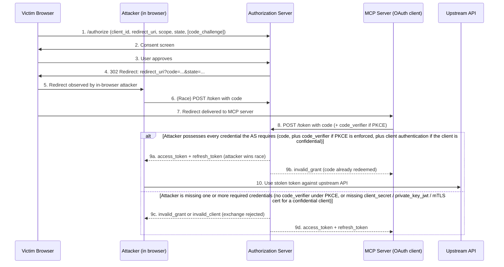

# SAFE-T1507: Authorization Code Interception

## Overview
**Tactic**: Credential Access (ATK-TA0006)  
**Technique ID**: SAFE-T1507  
**Severity**: High  
**First Observed**: Threat documented 2013-01 (RFC 6819 §4.4.1.1); PKCE mitigation standardized 2015-09 (RFC 7636). No MCP-specific incident was identified during this review.  
**Last Updated**: 2026-04-23  
**Author**: bishnu bista

> **Note**: Authorization-code interception is a long-standing, well-catalogued OAuth 2.0 threat. The MCP-specific exposure arises in two layers: (a) MCP servers act as OAuth clients to upstream providers (Google, Slack, GitHub, Notion, etc.), inheriting whatever flow hardening the upstream authorization server enforces; and (b) MCP clients authorize against MCP servers under the 2025-06-18 MCP authorization spec, which mandates PKCE and explicitly cites code-interception prevention as its purpose. This review did not identify a publicly disclosed incident where an MCP deployment was breached specifically via authorization-code interception; the underlying OAuth attack primitives are nevertheless well-documented outside MCP and the MCP threat surface inherits them.

## Description

Authorization Code Interception is a credential-access technique in which an adversary captures a short-lived OAuth 2.0 authorization code during the redirect that follows user consent, then exchanges that code at the token endpoint to obtain access (and often refresh) tokens. The code is a one-time credential with a recommended lifetime of at most 10 minutes ([RFC 6749 §4.1.2](https://datatracker.ietf.org/doc/html/rfc6749#section-4.1.2)), so the attacker must either race the legitimate client to the token endpoint or prevent the legitimate client from redeeming the code at all.

In MCP deployments, two distinct OAuth relationships are exposed to this class of attack. First, MCP servers routinely act as OAuth clients to upstream services to fetch user data on behalf of the LLM; the authorization-code flow executed by the MCP server is functionally identical to any other OAuth client flow and subject to the same interception vectors. Second, the [MCP 2025-06-18 Authorization specification](https://modelcontextprotocol.io/specification/2025-06-18/basic/authorization) defines how MCP clients authorize against MCP servers (which act as OAuth 2.1 resource servers) and explicitly addresses this threat: *"MCP clients MUST implement PKCE according to OAuth 2.1 Section 7.5.2. PKCE helps prevent authorization code interception and injection attacks by requiring clients to create a secret verifier-challenge pair, ensuring that only the original requestor can exchange an authorization code for tokens."* Because code exchange and `code_verifier` verification occur at the authorization server (not at the MCP resource server), an authorization server that accepts token requests without enforcing `code_verifier` validation remains exploitable even when the MCP client correctly generates a verifier.

Once the attacker exchanges a stolen code, the resulting tokens are indistinguishable from legitimate ones for the scopes granted. Because the token exchange itself succeeds, no downstream API sees a failure; detection relies on observing the symptom at the *code* stage (duplicate redemption, timing anomaly, or codes visible in unexpected locations) rather than at the token-use stage.

## Attack Vectors

### Primary Vector: Man-in-the-Browser Code Interception
- **Method**: A malicious browser extension, a compromised JavaScript dependency loaded on the redirect-target page, or in-browser malware reads the authorization code from the URL of the redirect back to the client's `redirect_uri`. The attacker then races the legitimate client to the token endpoint.
- **Prerequisites**: Attacker controls code running in the victim's browser context for the duration of the OAuth flow. A compliant authorization server does not enforce PKCE for the target client, or the attacker has also captured the `code_verifier` (e.g., via the same extension).
- **Detection difficulty**: Medium — duplicate-exchange attempts and sub-second race conditions are observable at the authorization server; after-the-fact evidence may be limited.

### Secondary Vectors

[RFC 6819 §4.4.1.1](https://datatracker.ietf.org/doc/html/rfc6819#section-4.4.1.1) ("Threat: Eavesdropping or Leaking Authorization 'codes'") enumerates the following leakage paths. Each remains applicable to MCP-server OAuth flows.

#### 1. Referrer-Header Leakage
- **Target**: Authorization codes included as query parameters in the redirect URL.
- **Method**: If the page at `redirect_uri` issues outbound requests (analytics, images, third-party scripts) before the server-side code exchange completes, the authorization code may appear in the `Referer` header sent to every third-party origin the page contacts.
- **Mitigation anchor**: `Referrer-Policy: no-referrer` (or `strict-origin`) on the redirect-target page; complete the code exchange server-side before rendering any page that issues outbound requests.

#### 2. Open-Redirect or Non-Exact `redirect_uri`
- **Target**: Authorization servers that accept non-exact `redirect_uri` matching (wildcards, subdomain matches, trailing-path flexibility) or clients that host open redirects on their registered `redirect_uri` domain.
- **Method**: Attacker registers a malicious `redirect_uri` within the accepted pattern, or chains through an open redirect on the legitimate client's domain to forward the code to an attacker endpoint.
- **Mitigation anchor**: [RFC 9700 §2.1](https://datatracker.ietf.org/doc/html/rfc9700#section-2.1) — *"authorization servers MUST utilize exact string matching except for port numbers in `localhost` redirection URIs of native apps."* The MCP 2025-06-18 authorization spec restates this requirement: *"Authorization servers MUST validate exact redirect URIs against pre-registered values to prevent redirection attacks."*

#### 3. Codes in Browser History, Server Logs, or Analytics Pipelines
- **Target**: Any component that records full URLs — browser history syncing across devices, web-server access logs, CDN logs, SIEM ingestion, client-side analytics instrumentation.
- **Method**: An attacker with log, history, or analytics access reads codes after the redirect. Even short-lived codes are usable if the logs are read and the code redeemed before the legitimate client completes the exchange or before expiry.
- **Mitigation anchor**: Server-side consumption of the code before the URL is logged; redaction of `code` and `state` parameters in log pipelines; `Referrer-Policy` (as above) to limit analytics exposure.

#### 4. TLS Interception with a Trusted Root
- **Target**: Corporate MITM proxies or devices with attacker-installed root certificates.
- **Method**: Full visibility of the OAuth redirect traffic through a break-and-inspect gateway.
- **Scope**: Limited to environments where the attacker has already achieved trust-anchor compromise; primarily an insider or advanced-persistent-threat scenario. RFC 6819 §4.4.1.1 does not enumerate this specific variant — it lists referrer headers, server request logs, open redirectors, and browser history — but the general eavesdropping threat the section catalogues applies when TLS integrity is broken upstream of the client.

### MCP-Specific Amplification

- **Multi-provider exposure**: An MCP server frequently holds tokens for multiple upstream providers (e.g., Gmail + Drive + Slack). A single intercepted code grants scope-bounded access to one provider, but correlated interception across a user's MCP onboarding session can yield a wide credential bundle.
- **PKCE obligation under the MCP spec**: MCP clients MUST implement PKCE per the [MCP 2025-06-18 Authorization specification](https://modelcontextprotocol.io/specification/2025-06-18/basic/authorization), regardless of whether the underlying authorization server classifies them as public or confidential clients. The spec notes that authorization servers used by MCP deployments must implement OAuth 2.1 "with appropriate security measures for both confidential and public clients" — in either case, the authorization server must enforce `code_verifier` validation at token exchange, since that is the step that binds the code to the originating client's memory.
- **Confused-deputy adjacency**: The [MCP Security Best Practices](https://modelcontextprotocol.io/specification/2025-06-18/basic/security_best_practices) document describes a related attack in which an MCP proxy server using a static client ID with a third-party authorization server can be tricked into redirecting an authorization code to an attacker-controlled `redirect_uri` registered via dynamic client registration. That attack is catalogued as a distinct confused-deputy pattern but shares the same end state — attacker possession of a redeemable authorization code — and is defended by the same per-client consent, exact `redirect_uri` validation, and `state` parameter controls.

## Technical Details

### Prerequisites
- The victim initiates an OAuth 2.0 authorization-code flow with a provider the MCP server (or the MCP client, under the MCP spec) integrates.
- At least one of the following holds:
  - Attacker code runs in the victim's browser during the redirect (extension, injected script, compromised dependency loaded on the redirect-target page).
  - The `redirect_uri` or the page it resolves to leaks the code via `Referer`, logs, analytics, or synced browser history.
  - The authorization server does not enforce exact `redirect_uri` matching, or the client hosts an open redirect on a registered host.
  - PKCE is not enforced at the authorization server for the target client, OR PKCE is enforced only client-side without server-side `code_verifier` validation.

### Attack Flow



1. **User initiates OAuth**: The MCP client or MCP server redirects the user's browser to the authorization server with a standard authorization request.
2. **User consents**: The authorization server issues a short-lived authorization code and redirects to `redirect_uri`.
3. **Code exposed**: The code is briefly visible in the browser URL or in a redirect chain.
4. **Attacker captures**: A malicious extension, injected script, referrer leak, or log read exposes the code to the attacker.
5. **Race to token endpoint**: The attacker POSTs to `/token` using the stolen code. The token endpoint enforces two independent defense layers, and the attacker must satisfy whichever of them the authorization server requires: (a) **client authentication** — for confidential clients, the AS authenticates the client at the token endpoint using `client_secret`, `private_key_jwt`, or mTLS; an attacker without the legitimate client's credentials is rejected with `invalid_client` regardless of PKCE state, and public clients skip this check since `client_id` is a non-secret identifier; (b) **PKCE proof of possession** — if PKCE is enforced, the attacker must also supply `code_verifier` matching the stored `code_challenge`; the verifier normally lives only in the legitimate client's memory, so the attacker fails unless they captured the verifier through the same vector that captured the code (for example the same malicious browser extension). The attack succeeds only when the attacker can satisfy every layer the AS enforces for the target client type.
6. **Token exchange**: Whoever reaches the token endpoint first and presents all required credentials (client authentication if applicable, and `code_verifier` when PKCE is enforced) receives the tokens. The loser sees `invalid_grant` — the RFC 6749 error returned for any invalid, expired, or already-redeemed code. Some providers surface a more descriptive `error_description` such as `code_already_used`, but the standards-defined error code is `invalid_grant`.
7. **Post-exploitation**: The attacker's tokens are indistinguishable from legitimate tokens and grant the scopes the user approved. Refresh tokens, if issued, extend access beyond the original session until the user explicitly revokes the authorization at the provider.

### Example Scenario

**Scenario: Browser extension intercepts Google OAuth code for an MCP server**

```text
1. User installs MCP server "gmail-helper" which integrates Gmail via Google OAuth.
2. User visits gmail-helper.example.com, clicks "Connect Gmail".
3. Browser redirects to https://accounts.google.com/o/oauth2/v2/auth?
        client_id=12345.apps.googleusercontent.com&
        redirect_uri=https://gmail-helper.example.com/oauth/callback&
        response_type=code&
        scope=https://www.googleapis.com/auth/gmail.readonly&
        state=a1b2c3
   (No PKCE — gmail-helper is a confidential client relying on client_secret only.)
4. User consents. Google redirects to:
   https://gmail-helper.example.com/oauth/callback?code=4/0AY0e-g7...&state=a1b2c3
5. A malicious extension with content-script access to gmail-helper.example.com
   reads the callback URL.
6. The extension's background service worker POSTs the code to the attacker's
   infrastructure.
7. The attacker has gmail-helper's client_id + client_secret (leaked in a prior
   breach) and POSTs:
       POST https://oauth2.googleapis.com/token
       Body: code=4/0AY0e-g7...
             client_id=12345.apps.googleusercontent.com
             client_secret=<leaked>
             redirect_uri=https://gmail-helper.example.com/oauth/callback
             grant_type=authorization_code
8. If the attacker reaches Google's /token endpoint before gmail-helper does,
   the attacker receives an access_token + refresh_token with gmail.readonly.
9. gmail-helper's subsequent exchange fails with invalid_grant.
```

**What changes when PKCE (RFC 7636) is enforced**: In step 3 the client generates a random `code_verifier` and sends `code_challenge` to the authorization server. Under `code_challenge_method=S256` (RFC 7636 §4.2), `code_challenge = BASE64URL-ENCODE(SHA256(ASCII(code_verifier)))`; under the legacy `plain` method, `code_challenge = code_verifier`. In step 7 the attacker's token request must supply the original `code_verifier`; the verifier normally stays in the legitimate client's process, so the attacker cannot produce it and the exchange fails. PKCE is bypassed only if the attacker captures the `code_verifier` through the same vector that captured the code (e.g., a malicious extension with access to the client's JavaScript state), which is why PKCE is a necessary but not sufficient defense against a full man-in-the-browser compromise — and why confidential-client authentication (when applicable) remains an independent, complementary defense layer even when PKCE is enabled.

## Impact Assessment

- **Confidentiality**: High — Stolen tokens grant whatever scopes the user consented to. OAuth consent screens frequently request broader scopes than the immediate action requires.
- **Integrity**: High — Most OAuth scopes for productivity providers (Gmail, Drive, Slack, GitHub, Notion) include write permissions, enabling data modification, email sending, or resource deletion.
- **Availability**: Low–Medium — Indirect; stolen tokens could be used for rate-limit consumption or resource deletion depending on scope.
- **Scope**: Bounded by the stolen token's scope. For MCP servers that integrate multiple providers, correlated interception across the onboarding flow can broaden scope substantially.

### Additional Impacts
- **MFA bypass**: Post-consent tokens do not require re-authentication; MFA at the upstream provider does not protect subsequent token use.
- **Persistent access via refresh tokens**: If the stolen code yields a refresh token, the attacker retains access until the user explicitly revokes the authorization in the provider's dashboard.
- **Silent from the provider's perspective**: The attacker's API calls are indistinguishable from legitimate MCP-server traffic unless the provider correlates tokens to unexpected client IPs, ASNs, or user agents.

## Detection Methods

### Indicators of Compromise (IoCs)
- Multiple `POST /token` requests with the **same** authorization code from different source IPs or different TLS fingerprints within a few seconds.
- Token-exchange attempts that fail with `invalid_grant` (the RFC 6749 error code; some providers additionally surface an `error_description` such as `code_already_used` or `redemption_limit`) at the legitimate MCP server's OAuth client shortly after a successful authorization response — an asymmetric signal that something else redeemed the code first.
- Authorization codes observed in `Referer` headers, in the `url` field of analytics payloads, in web-server access logs, or in synced browser history.
- `redirect_uri` parameters that differ from registered exact matches on authorization servers that previously allowed wildcards and are tightening policy.
- Post-exchange API calls from tokens issued to MCP infrastructure appearing from client IPs or autonomous-system numbers unrelated to the MCP server's known deployment.

### Detection Rules

**Important**: The following rule is written in Sigma format and contains example patterns only. The duplicate-code and race-condition selectors express correlation/windowing semantics that require Sigma v2 correlation rules or equivalent stateful SIEM logic keyed on `authorization_code`; they are documented inline for clarity but are not runnable as a single stateless Sigma rule. Authorization-code-interception vectors evolve as PKCE enforcement spreads; attackers shift toward client-secret exfiltration or authorization-server impersonation (see [SAFE-T1009](../SAFE-T1009/README.md)) once `code_verifier` enforcement is universal. Organizations should:
- Correlate authorization-server logs with client-side token-exchange logs to detect duplicate redemption.
- Monitor for tokens used from client IPs or ASNs not associated with the registered MCP deployment.
- Review `Referrer-Policy` and client-side analytics pipelines on every `redirect_uri` page; the `selection_code_in_referrer` branch below relies on web/proxy/analytics logs, not on the token-exchange logsource the other selectors use.

```yaml
# EXAMPLE SIGMA RULE - Not comprehensive
title: MCP OAuth Authorization Code Interception Detection
id: 2aa0f9c2-f9b0-4b20-96e8-e2325f215491
status: experimental
description: Detects potential authorization code interception through duplicate token exchange attempts, sub-second token-endpoint races, or authorization codes appearing in HTTP Referer headers
author: SAFE-MCP Team
date: 2025-01-20
references:
  - https://github.com/SAFE-MCP/safe-mcp/tree/main/techniques/SAFE-T1507
  - https://datatracker.ietf.org/doc/html/rfc6749
  - https://datatracker.ietf.org/doc/html/rfc6819
  - https://datatracker.ietf.org/doc/html/rfc7636
  - https://datatracker.ietf.org/doc/html/rfc9700
logsource:
  product: mcp
  service: oauth_token_exchange
detection:
  # Correlation selectors — require Sigma v2 correlation rules or equivalent
  # stateful SIEM logic keyed on `authorization_code`.
  selection_duplicate_code:
    authorization_code|count|gt: 1
    timeframe: 5s
  selection_race_condition:
    token_exchange_timestamp:
      - '|difference|lt: 1s'
    same_authorization_code: true
    different_source_ip: true
  # Web/proxy/analytics logsource selector — callback page logs, not token-exchange logs.
  selection_code_in_referrer:
    http_referrer|contains:
      - '*code=*'
      - '*authorization_code=*'
    http_referrer|not|contains:
      - 'oauth.example.com'
  condition: selection_duplicate_code or selection_race_condition or selection_code_in_referrer
falsepositives:
  - Legitimate retry attempts with the same authorization code (RFC 6749 §4.1.2 requires the AS to deny reuse; the standards-defined error is invalid_grant, sometimes surfaced by providers with an error_description such as code_already_used)
  - Load-balanced token endpoints where the client-side source IP legitimately varies between the first attempt and its retry
  - Development/testing environments with instrumented OAuth flows
level: high
tags:
  - attack.credential_access
  - attack.t1557
  - safe.t1507
```

> The original `detection-rule.yml` for this technique used `attack.t1550` alone. This revision refines the rule tagging to `attack.t1557` (Adversary-in-the-Middle — the interception step), since this analytic observes authorization-code and token-exchange telemetry rather than application access token use. The broader replay mapping to `attack.t1550.001` (Use Alternate Authentication Material: Application Access Token) is retained at the narrative level — see the MITRE mapping section — but is not claimed by this specific rule's tags.

### Behavioral Indicators
- Authorization flows that generate a code but never result in a successful token exchange from the registered client.
- Bursts of `invalid_grant` errors at the MCP server's token-exchange handler with no preceding authorization failure.
- First-time redirect through a recently installed browser extension for an OAuth flow the user has previously completed without extension involvement.
- Authorization completions followed by API calls to the upstream provider from client IPs that have never previously hosted the MCP deployment.

## Mitigation Strategies

### Preventive Controls

1. **Enforce PKCE (RFC 7636) server-side, not just client-side.** The `code_verifier` binds token exchange to the originating client's process. The authorization server MUST reject any token exchange that lacks a `code_verifier` or whose `code_verifier` does not match the stored `code_challenge` under the `code_challenge_method` the client declared (`S256`, which RFC 7636 §4.2 requires for clients technically capable of it and which [RFC 9700 §2.1.1](https://datatracker.ietf.org/doc/html/rfc9700#section-2.1.1) recommends; or the legacy `plain` method where explicitly supported). RFC 7636 scopes PKCE to public clients; RFC 9700 §2.1.1 requires PKCE (MUST) for all public clients and recommends it (RECOMMENDED) for confidential clients. The MCP 2025-06-18 Authorization specification is stricter: MCP clients MUST implement PKCE regardless of client type.  
   See also [SAFE-M-38: PKCE Enforcement](../../mitigations/SAFE-M-38/README.md) for the cross-technique PKCE mitigation entry.

2. **Exact-match `redirect_uri`.** Per [RFC 9700 §2.1](https://datatracker.ietf.org/doc/html/rfc9700#section-2.1) — *"authorization servers MUST utilize exact string matching except for port numbers in `localhost` redirection URIs of native apps"* — reject any authorization request whose `redirect_uri` does not exactly match a pre-registered value. Disallow wildcards, subdomain patterns, and trailing-path flexibility. The MCP 2025-06-18 authorization spec restates this: *"Authorization servers MUST validate exact redirect URIs against pre-registered values to prevent redirection attacks."*  
   <!-- TODO: No current SAFE-M covers authorization-server exact `redirect_uri` string matching against pre-registered values. Domain-level callback restrictions (such as SAFE-M-17, which only enforces domain-level callback URL matching) are materially weaker and are NOT sufficient for this control. Assign a dedicated SAFE-M-NN once the mitigations catalog covers AS-side exact `redirect_uri` matching. -->

3. **Single-use authorization codes with short TTL.** Per [RFC 6749 §4.1.2](https://datatracker.ietf.org/doc/html/rfc6749#section-4.1.2): *"A maximum authorization code lifetime of 10 minutes is RECOMMENDED"* and *"The client MUST NOT use the authorization code more than once. If an authorization code is used more than once, the authorization server MUST deny the request and SHOULD revoke (when possible) all tokens previously issued based on that authorization code."* Enforce both properties strictly at the authorization server; short TTLs shrink the race window and single-use enforcement turns a successful race into a detectable `invalid_grant` error (or a provider-specific variant such as `code_already_used`) at the legitimate client.

4. **[SAFE-M-13: OAuth Flow Verification](../../mitigations/SAFE-M-13/README.md)**. Validate the `iss` parameter ([RFC 9207](https://datatracker.ietf.org/doc/html/rfc9207)) in authorization responses before redeeming the code. This addresses the related mix-up-attack class ([SAFE-T1009](../SAFE-T1009/README.md)) and hardens the OAuth flow against category-adjacent interception patterns.

5. **`Referrer-Policy` on redirect-target pages.** The page that receives the `code` query parameter must set `Referrer-Policy: no-referrer` (or `strict-origin`) so the code does not leak in outbound `Referer` headers. Complete the code exchange server-side before rendering any page that issues outbound requests. RFC 6819 §4.4.1.1 enumerates referrer leakage as a primary interception path.

6. **Minimize front-channel code exposure.** Server-side redirect handlers should consume and invalidate the code before returning any HTML. Avoid SPA patterns that parse the code from the URL in client-side JavaScript, since JavaScript execution is the same threat surface that hosts the man-in-the-browser attacker.

7. **Protect client credentials as an independent defense layer.** For confidential clients, token-endpoint client authentication (`client_secret`, `private_key_jwt`, or mTLS) is an independent defense that stops the attacker even if PKCE is bypassed by a same-context `code_verifier` theft — and it is the primary defense when PKCE is not enforced. Rotate credentials on suspected exposure; prefer asymmetric schemes (`private_key_jwt`, mTLS) over shared-secret schemes where the authorization server supports them.

8. **`state` parameter validation.** Generate a cryptographically random `state` per authorization request, bind it server-side to the user's session or consent decision, and validate exact equality at the callback. The MCP 2025-06-18 Security Best Practices document (*"OAuth State Parameter Validation"*) ties this control to authorization-code interception prevention and specifies that the `state`-tracking cookie MUST NOT be set until after the user has approved the consent screen.

### Detective Controls

1. **Duplicate-code detection at the authorization server.** Alert on any `POST /token` whose authorization code has already been redeemed — even when the second attempt fails — because this is the signal that a race occurred.

2. **Cross-correlate AS and client logs.** For every authorization code issued, verify the registered client subsequently redeemed it. Codes that are never redeemed by the intended client, or that the intended client saw fail with `invalid_grant` (or a provider-specific variant such as `code_already_used`), warrant investigation.

3. **Monitor referrer, log, and analytics pipelines for OAuth-parameter leakage.** Scan web-server access logs, analytics payloads, and SIEM ingestion for `code=`, `authorization_code=`, and `state=` parameters appearing in URLs outside the expected redirect path.

4. **Token-usage fingerprinting.** Baseline the client IPs, ASNs, and user agents from which tokens issued to each MCP server are used, and alert on deviation. Tokens stolen via code interception are typically used from the attacker's infrastructure, not the MCP server's.

### Response Procedures

1. **Immediate actions**:
   - Revoke the authorization at the upstream provider (delete the user's grant) — this invalidates both access and refresh tokens.
   - Re-issue a fresh authorization flow only after confirming the endpoint device is clean.
   - If `client_secret` is suspected of exposure, rotate it and redeploy the MCP server before re-authorization.

2. **Investigation steps**:
   - Correlate authorization-server logs, MCP-server token-exchange logs, and upstream API access logs for the affected user within the last token lifetime.
   - Identify the interception vector: duplicate redemption (MITB race), referrer leakage (downstream page analytics), or misconfigured `redirect_uri` matching.
   - For MITB suspicion: enumerate browser extensions installed on the victim's browser and correlate installation timestamps with the first suspicious OAuth flow.

3. **Remediation**:
   - Enforce PKCE at the authorization server for all future flows involving the affected client.
   - Tighten `redirect_uri` policy to exact match.
   - Deploy `Referrer-Policy: no-referrer` on all OAuth callback pages.
   - User guidance: recommend a clean browser profile (or disabled extensions) for high-scope OAuth flows, and periodic audit of active OAuth grants in provider dashboards.

## Related Techniques
- [SAFE-T1009](../SAFE-T1009/README.md): OAuth Authorization Server Mix-Up — Attacker confuses the client about which AS issued the code; often combined with or adjacent to code interception.
- [SAFE-T1408](../SAFE-T1408/README.md): OAuth Protocol Downgrade — Forces the flow to a less-protected grant (e.g., implicit) that exposes tokens without the PKCE/code-exchange step; an upstream enabler when PKCE is the primary defense.
- [SAFE-T1506](../SAFE-T1506/README.md): Infrastructure Token Theft — Post-exchange theft from logs, TLS termination proxies, or infrastructure; the step after a successful (legitimate) code exchange, not an alternative to it.
- [SAFE-T1504](../SAFE-T1504/README.md): Token Theft via API Response — Post-exchange theft by inducing an MCP tool to return tokens; same end state (attacker-held token), different vector (LLM-mediated vs. redirect interception).

## References

### Standards and specifications
- [RFC 6749 — The OAuth 2.0 Authorization Framework](https://datatracker.ietf.org/doc/html/rfc6749) (October 2012) — authorization-code grant definition (§4.1); code single-use and TTL (§4.1.2)
- [RFC 6819 — OAuth 2.0 Threat Model and Security Considerations](https://datatracker.ietf.org/doc/html/rfc6819) (January 2013) — §4.4.1.1 "Threat: Eavesdropping or Leaking Authorization 'codes'" catalogues the interception vectors used in this technique
- [RFC 7636 — Proof Key for Code Exchange by OAuth Public Clients (PKCE)](https://datatracker.ietf.org/doc/html/rfc7636) (September 2015) — primary mitigation; scoped to public clients
- [RFC 9207 — OAuth 2.0 Authorization Server Issuer Identification](https://datatracker.ietf.org/doc/html/rfc9207) (March 2022) — `iss` parameter; defense against the adjacent mix-up-attack class
- [RFC 9700 — Best Current Practice for OAuth 2.0 Security](https://datatracker.ietf.org/doc/html/rfc9700) (January 2025) — §2.1 exact `redirect_uri` matching; §2.1.1 PKCE for public clients (MUST) and confidential clients (RECOMMENDED); §4.5 authorization-code injection attack and PKCE countermeasure
- [Model Context Protocol Specification — Authorization (2025-06-18)](https://modelcontextprotocol.io/specification/2025-06-18/basic/authorization) — MCP's Authorization Code Protection section mandates PKCE for all MCP clients
- [Model Context Protocol Specification — Security Best Practices (2025-06-18)](https://modelcontextprotocol.io/specification/2025-06-18/basic/security_best_practices) — Confused Deputy Problem and OAuth State Parameter Validation sections

### Research
- [Fett, Küsters, Schmitz — A Comprehensive Formal Security Analysis of OAuth 2.0 (arXiv:1601.01229)](https://arxiv.org/abs/1601.01229) — formal analysis of OAuth 2.0 across all four grant types; identifies several previously unknown attacks breaking OAuth's intended security properties

## MITRE ATT&CK Mapping

**Note**: MITRE ATT&CK does not include OAuth-specific techniques or enumerate man-in-the-browser as a named realization. The mappings below are the closest tactic-level analogues, split between the *interception* step and the *replay* step.

- [T1557 — Adversary-in-the-Middle](https://attack.mitre.org/techniques/T1557/) — *Closest match for the interception step*. The MITRE page enumerates network-level realizations (DNS manipulation, ARP poisoning, DHCP spoofing, SSL/TLS downgrade) rather than in-browser realizations; the shared element is the adversary positioning themselves within the communication path between the browser and the legitimate OAuth client. Man-in-the-browser fits this positioning model even though MITRE does not list it as an enumerated example.
- [T1550.001 — Use Alternate Authentication Material: Application Access Token](https://attack.mitre.org/techniques/T1550/001/) — *Match for the replay step*. Once the attacker has exchanged the intercepted code for an access token, MITRE's description applies directly: *"Adversaries may use stolen application access tokens to bypass the typical authentication process and access restricted accounts, information, or services on remote systems."* The original `detection-rule.yml` used the bare `T1550` parent technique; `T1550.001` is the specific sub-technique for OAuth-style access tokens.

## Version History

| Version | Date | Changes | Author |
|---------|------|---------|--------|
| 1.0 | 2026-04-23 | Initial documentation of Authorization Code Interception — L3 reconstruction authored from the detection rule, root corpus README slot, and verified primary sources (RFCs 6749, 6819, 7636, 9207, 9700; MCP 2025-06-18 authorization and security-best-practices specifications; MITRE T1557, T1550.001; Fett et al. arXiv:1601.01229). | bishnu bista |
