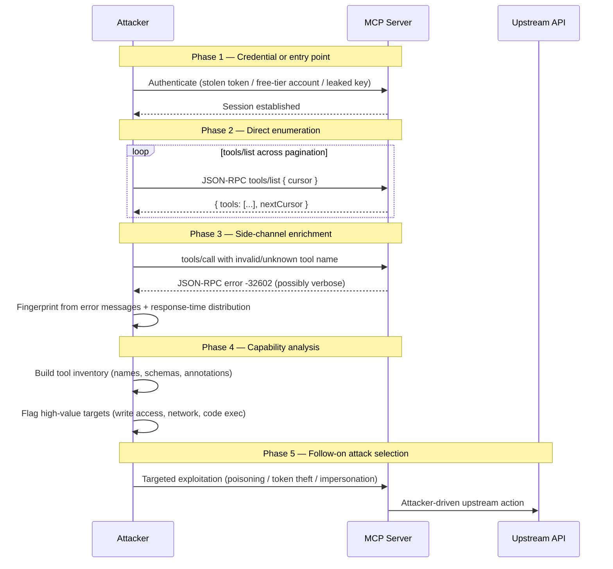

# SAFE-T1602: Tool Enumeration

## Overview
**Tactic**: Discovery (ATK-TA0007)  
**Technique ID**: SAFE-T1602  
**Severity**: Medium  
**First Observed**: Research-based analysis (2025). No specific public incident attributed to this technique in isolation; it is typically observed as the reconnaissance phase of broader MCP-focused attack chains.  
**Last Updated**: 2026-04-24  
**Author**: Asim Mahat (v1.0, 2025-10-25); bishnu bista (v1.1 validation, 2026-04-24)

> **Note**: The Model Context Protocol makes tool discovery a first-class, documented feature — any MCP-authorized client can call `tools/list` and receive the server's complete tool manifest with names, descriptions, and input schemas ([MCP 2025-06-18 Tools specification](https://modelcontextprotocol.io/specification/2025-06-18/server/tools)). This technique is not about discovering something the protocol hides; it is about **abusing the legitimate discovery mechanism at scale or through side channels** — unauthenticated enumeration, fingerprinting through error messages, timing side channels, and aggregation across many servers — to build attack-surface intelligence for follow-on exploitation. The mitigations in this document therefore distinguish between protocol facts cited verbatim from the MCP specification and SAFE-M hardening guidance that goes beyond the spec's baseline.

## Description

Tool Enumeration is a Discovery-phase technique in which an adversary maps the capabilities exposed by an MCP server (or a population of MCP servers) to inform follow-on attacks. In an authorized MCP session, `tools/list` returns a complete catalog of tools with names, human-readable descriptions, and JSON-schema input definitions. An attacker who holds — or can obtain — any credential with access to that endpoint gains a structured view of what the server can do, including which tools can write to disk, make outbound HTTP requests, execute code, or expose sensitive data. The MCP specification requires servers to *"Implement proper access controls"* and to *"Rate limit tool invocations"* ([MCP 2025-06-18 Tools §Security Considerations](https://modelcontextprotocol.io/specification/2025-06-18/server/tools)). The plain reading of "rate limit tool invocations" is that it covers `tools/call`; whether the same discipline extends to `tools/list` is not settled by the spec itself and is treated in this document as SAFE-M hardening guidance. Servers that skip the spec's explicit access-control and tool-invocation rate-limit requirements are enumerable at attacker-controlled rate on `tools/call`; servers that additionally leave `tools/list` unbounded are enumerable at attacker-controlled rate on the primary manifest endpoint.

Beyond authorized enumeration, adversaries infer capabilities through side channels on less-protected surfaces: verbose error messages that reveal tool names or argument schemas, timing differences that fingerprint which tools exist, SDK documentation and example clients that leak manifest structure, JS bundles delivered to browser-based MCP clients, and publicly indexed developer pages. MCP deployments that layer a proxy server between MCP clients and upstream providers face an additional inference-level exposure: each layer of the proxy chain is a separate potential enumeration target, and inconsistent rate-limit enforcement between proxy and upstream can let an attacker enumerate the upstream's tools even when the proxy's rate limits appear to hold. This proxy-layer risk is the authors' inference about enumeration under MCP's proxy pattern, not a spec-level guarantee; the MCP 2025-06-18 specification does not explicitly address rate-limit tier alignment between proxies and upstreams.

Enumeration is a low-signal precursor. It rarely triggers security alerts on its own because `tools/list` invocation is expected traffic, yet it materially shapes the adversary's follow-on behavior: which tools to poison (see [SAFE-T1001](../SAFE-T1001/README.md) Tool Poisoning Attack), which credentials to steal (see [SAFE-T1504](../SAFE-T1504/README.md), [SAFE-T1505](../SAFE-T1505/README.md), [SAFE-T1507](../SAFE-T1507/README.md)), and which servers to impersonate (see [SAFE-T1004](../SAFE-T1004/README.md)). Effective defense anchors on rate limiting, access-controlled `tools/list` invocation, minimal metadata in tool descriptions, and cross-request correlation rather than pattern-match detection of any single call.

## Attack Vectors

### Primary Vector: Abuse of the `tools/list` Endpoint

- **Method**: The attacker obtains any MCP credential that grants access to the target server (stolen OAuth token, leaked API key, a compromised developer credential, or a free-tier account on a multi-tenant MCP gateway) and issues `tools/list` at high volume — either against one server at scale to detect dynamic tool registration and `tools/list_changed` notifications, or across many MCP servers to build a cross-deployment capability map.
- **Prerequisites**: Authentication material for at least one MCP server; a client that speaks JSON-RPC 2.0 (or one of the MCP SDKs); absence or weakness of rate limiting on the `tools/list` endpoint.
- **Detection difficulty**: Medium — legitimate clients also call `tools/list` (especially on session start and `tools/list_changed` events). Signal comes from rate, breadth, and cross-session correlation rather than any single call.

### Secondary Vectors

#### 1. Error-Message Fingerprinting
- **Method**: The attacker calls non-existent or malformed `tools/call` requests against the target and parses the JSON-RPC error response. The MCP specification defines `-32602` as the error for unknown tools or invalid arguments ([MCP Tools §Error Handling](https://modelcontextprotocol.io/specification/2025-06-18/server/tools)); servers that echo the attempted tool name, argument schema, or internal handler state in the error's `message` or `data` fields leak enumeration intelligence even without a successful `tools/list` call.
- **Mitigation anchor**: Constant, non-descriptive error messages for unknown tools and schema violations; separate verbose diagnostics behind an admin-only flag.

#### 2. Timing and Side-Channel Inference
- **Method**: The attacker measures response-time distributions on `tools/call` with varying tool names. Tools that exist but fail authorization may produce different latency than tools that do not exist at all — letting the attacker infer tool presence without ever obtaining a confirmed `tools/list` response.
- **Mitigation anchor**: Constant-time unknown-tool rejection; uniform error handling between "unauthorized" and "unknown" cases; response-time jitter on sensitive code paths.

#### 3. Leakage from Public Artifacts
- **Method**: The attacker harvests tool manifests from places they were never meant to live: SDK documentation generated from the `inputSchema` of production tools, README files in MCP server repositories that include example `tools/list` output, JavaScript bundles shipped to browser-based MCP clients with tool metadata baked in, OpenAPI specs auto-published alongside the MCP server, and developer consoles indexed by search engines.
- **Mitigation anchor**: Review what ships to each audience; keep production tool manifests out of public documentation pipelines; treat tool names and descriptions as tier-1 sensitive metadata in DLP tooling.

#### 4. Cross-Server Aggregation
- **Method**: The attacker combines enumeration data from many MCP deployments — each individually unremarkable — into a population view. The [MCPTox benchmark](https://arxiv.org/abs/2508.14925) (Wang et al., 2025) surveyed 45 live MCP servers and 353 tools, demonstrating that the cross-server tool landscape is large and comparable enough to benchmark. An adversary doing the same for targeting purposes can identify which tools appear across multiple deployments (high-value for writing a multi-target exploit) and which are unique to a specific vendor (high-value for targeted attacks).
- **Mitigation anchor**: Recognize that per-server rate limits do not defend against cross-server enumeration; signal-share suspicious enumeration patterns across MCP deployments through industry ISACs or threat-intel feeds.

### MCP-Specific Amplification

- **Proxy-pattern exposure**: MCP proxy servers that forward `tools/list` to upstream providers expose the upstream's tool surface at the proxy's rate-limit tier, not the upstream's. Inconsistent rate-limit enforcement between layers is a direct enumeration vector. The MCP 2025-06-18 specification does not prescribe how rate limits must align between a proxy and its upstream, so this is a deployment-time hardening concern rather than a spec-level requirement.
- **`listChanged` notification amplification**: Servers that declare the `listChanged` capability emit `notifications/tools/list_changed` when the tool set changes. An attacker who can trigger dynamic tool registration (e.g., by installing a plugin on a shared MCP server) can use these notifications as an oracle to confirm their changes landed and to map how other clients' tool sets are affected.
- **Tool-annotation trust**: The MCP specification explicitly warns: *"clients MUST consider tool annotations to be untrusted unless they come from trusted servers."* Annotations — which describe tool behavior in machine-readable form — are rich enumeration targets because they often include capability flags (read-only, destructive, requires network) that let an attacker filter tools by exploitability without invoking them.

## Technical Details

### Prerequisites

- Authentication material for at least one MCP server (stolen OAuth token, leaked API key, free-tier or trial account on a multi-tenant MCP gateway, or legitimate insider access).
- A JSON-RPC 2.0 client — any of the MCP SDKs, a custom script, or `curl` with a hand-rolled JSON-RPC envelope.
- For side-channel vectors: the ability to measure response latency with sub-hundred-millisecond resolution, or read access to server error responses.
- Absence or weakness of at least one of: rate limiting on `tools/list`, access-controlled tool manifest, minimal error messages, DLP on developer documentation pipelines.

### Attack Flow



1. **Credential acquisition**: the attacker obtains any credential that satisfies the target server's authorization check.
2. **Direct enumeration**: paginated `tools/list` calls produce the complete tool catalog — names, titles, descriptions, `inputSchema`, `outputSchema`, and annotations.
3. **Side-channel enrichment**: invalid `tools/call` requests and timing measurements fill in what the direct enumeration missed (tools gated by role, tools that exist but are hidden from `tools/list` responses for that session).
4. **Capability analysis**: offline, the attacker categorizes tools by the follow-on behavior they enable — file system access, outbound HTTP, code execution, credential exposure, upstream-API scope — and ranks them by exploit utility.
5. **Follow-on attack selection**: the enumeration output is the input to [SAFE-T1001](../SAFE-T1001/README.md) (Tool Poisoning), [SAFE-T1004](../SAFE-T1004/README.md) (Server Impersonation), [SAFE-T1504](../SAFE-T1504/README.md) (Token Theft via API Response), and similar follow-on techniques.

### Example Scenario

**Scenario: Free-tier gateway enumeration across tenants**

```text
1. Attacker signs up for a free-tier account on a multi-tenant MCP gateway
   that exposes a curated set of MCP servers (company productivity tools,
   code-execution sandboxes, etc.) under a single JSON-RPC endpoint.

2. Attacker issues `tools/list` against each exposed server:
       POST /mcp
       Content-Type: application/json
       Authorization: Bearer <free-tier-token>
       { "jsonrpc":"2.0", "id":1, "method":"tools/list",
         "params":{"cursor":null} }

3. For each server, attacker paginates through the response's `nextCursor`
   until the full manifest is captured. Each manifest entry includes the
   tool name, description, JSON schema of arguments, and any annotations.

4. Attacker extracts capability signals from annotations and descriptions:
   - annotations.readOnlyHint=false  → tool can mutate state
   - description contains "HTTP" / "fetch" / "URL"  → outbound network
   - description contains "exec" / "run" / "eval"  → code execution
   - description contains "credential" / "token" / "secret"  → auth surface

5. Across the gateway's multi-tenant fleet, attacker identifies two
   high-value candidates:
   - A shared code-execution sandbox whose `input_schema` accepts arbitrary
     language + code, with no authenticated scope restrictions documented.
   - A calendar-integration tool whose description mentions "service
     account credentials" — candidate for SAFE-T1504-style token exfil.

6. Attacker's free-tier rate limit allowed ~30 `tools/list` calls per
   minute. Across 48 hours, they pulled manifests from every server on the
   gateway without triggering a single abuse-alert — the gateway's rate
   limiter was scoped to `tools/call` only, not to `tools/list`.
```

**What changes when `tools/list` is access-controlled and rate-limited per hardening recommendations built on top of the MCP spec**: authenticated free-tier accounts receive a tool manifest scoped to their tier (tools requiring higher scopes either are omitted from the manifest entirely (scope-filtering) or return an error that does not reveal the tool exists (constant error semantics)); `tools/list` has the same rate limit as `tools/call` (preventing manifest-sweep patterns); cross-server aggregation requires an attacker to hold credentials for each target separately rather than one gateway credential; and `tools/list_changed` notifications are scoped to the tool set the requesting session is authorized to see.

## Impact Assessment

- **Confidentiality**: Medium (direct) → High (after follow-on attacks) — enumeration itself only exposes tool metadata, but that metadata drives follow-on attacks that expose the data the tools can access.
- **Integrity**: Low (direct) → High (after follow-on) — enumeration does not modify state; the follow-on attacks it enables (tool poisoning, impersonation) do.
- **Availability**: Low–Medium — high-volume enumeration can exhaust `tools/list` rate budgets, producing service degradation for legitimate clients on gateways that share quota.
- **Scope**: Bounded by what a single credential sees. On multi-tenant gateways, scope can widen dramatically if the gateway misimplements per-tenant manifest filtering.

### Additional Impacts

- **Reduced defender time-to-exploit**: a capability-mapped server lets the adversary skip their own reconnaissance and move straight to exploitation; enumeration compresses the timeline of an MCP-driven breach.
- **Silent third-party exposure**: in the proxy pattern, the upstream provider receives no signal that its tool surface has been mapped because the enumeration happens against the proxy, not the upstream.
- **Compounding risk across servers**: organizations that run multiple MCP servers with shared authentication infrastructure (e.g., an internal SSO) face compounding enumeration exposure when a single credential is stolen.

## Detection Methods

### Indicators of Compromise (IoCs)

- Anomalously high `tools/list` call volume from a single session, IP, or credential — particularly calls that paginate through the full cursor chain repeatedly without intervening `tools/call`.
- `tools/list` calls from accounts that have never subsequently invoked `tools/call` against the enumerated tools.
- Bursts of `tools/call` with varied invalid tool names producing `-32602` errors (fingerprinting pattern).
- `tools/call` requests with consistent argument variation on unknown tools — attempts to map `inputSchema` via trial and error.
- Access to tool-manifest endpoints or SDK documentation routes from user agents inconsistent with known developer tooling (e.g., `curl`, `python-requests`, headless browsers).
- Cross-session correlation: a credential that enumerates multiple MCP servers on the same gateway within a short window, especially if those servers are normally accessed in isolation.

### Detection Rules

**Important**: The following rule is written in Sigma format and contains example patterns only. Tool enumeration is an inherently legitimate behavior; detection relies on rate, breadth, and correlation rather than any single invocation. Organizations should:
- Instrument `tools/list` and `tools/call` at the gateway and correlate credentials, source IPs, and server IDs across the full session.
- Track per-credential distinct-servers-enumerated counts on short windows; alert on step-function increases.
- Review error-response payloads regularly to confirm that unknown-tool responses do not leak schema or argument names.

```yaml
# EXAMPLE SIGMA RULE - Not comprehensive
title: MCP Tool Enumeration Detection
id: 7b3e4a9c-2d18-4f62-9a71-e83d5c6b2f40
status: experimental
description: Detects potential MCP tool enumeration through anomalous tools/list volume, cross-server enumeration by a single credential, and fingerprinting patterns against unknown-tool error responses
author: SAFE-MCP Team
date: 2026-04-24
references:
  - https://github.com/SAFE-MCP/safe-mcp/tree/main/techniques/SAFE-T1602
  - https://modelcontextprotocol.io/specification/2025-06-18/server/tools
  - https://attack.mitre.org/techniques/T1526/
  - https://attack.mitre.org/techniques/T1518/
logsource:
  product: mcp
  service: jsonrpc_requests
detection:
  # Correlation selectors — require Sigma v2 correlation rules or equivalent
  # stateful SIEM logic keyed on credential/session/source IP.
  selection_high_volume_list:
    method: 'tools/list'
    count_per_credential|gt: 50
    timeframe: 5m
  selection_cross_server_sweep:
    method: 'tools/list'
    distinct_server_ids_per_credential|gt: 5
    timeframe: 10m
  selection_unknown_tool_fingerprint:
    method: 'tools/call'
    error_code: -32602
    count_distinct_tool_names_per_session|gt: 10
    timeframe: 5m
  selection_list_without_followup_call:
    method: 'tools/list'
    session_tools_call_count: 0
    session_duration|gt: 60
  condition: selection_high_volume_list or selection_cross_server_sweep or selection_unknown_tool_fingerprint or selection_list_without_followup_call
falsepositives:
  - Legitimate developer tools that periodically refresh tool manifests (MCP client SDKs on startup, IDE integrations)
  - Automated monitoring of tool availability (SRE health checks)
  - Gateway health probes during deployment
level: medium
tags:
  - attack.discovery
  - attack.t1526
  - attack.t1518
  - safe.t1602
```

### Behavioral Indicators

- A newly created credential that immediately enumerates every reachable MCP server on a gateway before invoking any tool.
- Off-hours enumeration activity from accounts associated with a time-zone-bounded user population.
- Enumeration followed within minutes by highly targeted `tools/call` invocations against the most permissive tools identified.
- User agents rotating across enumerations from the same credential (a signal of automation attempting to evade per-UA rate limits).
- Enumeration patterns that halt or sharply slow immediately after a `tools/list_changed` notification — consistent with an attacker whose goal was to observe dynamic registration.

## Mitigation Strategies

### Preventive Controls

1. **Apply rate limits to `tools/list` invocations — hardening recommendation.** The MCP Tools specification's Security Considerations section requires servers to *"Rate limit tool invocations"* ([MCP 2025-06-18 Tools §Security Considerations](https://modelcontextprotocol.io/specification/2025-06-18/server/tools)), which most plainly reads as applying to `tools/call`. Extending the same rate-limit discipline to `tools/list` is a SAFE-M hardening recommendation, not a direct spec requirement — but it is load-bearing for T1602 mitigation because `tools/list` is the primary enumeration vector. Rate-limiting only `tools/call` while leaving `tools/list` unbounded is a common misimplementation.

2. **Hardening recommendation: return scope-filtered manifests from `tools/list`.** The MCP specification does not mandate manifest filtering by caller scope — it only requires access controls on tool invocations generally — but scope filtering is a defensive hardening measure that limits enumeration blast radius on compromised credentials. Tools gated behind higher scopes SHOULD NOT appear in lower-scope `tools/list` responses. Administrative and debug tools in particular should not appear in end-user-scoped manifests.

3. **Constant, non-descriptive error messages.** `-32602` responses for unknown tools and invalid arguments must not reveal whether the tool exists, which schema was expected, or any internal handler state. Verbose diagnostic errors belong in admin-only development channels. ([MCP Tools §Error Handling](https://modelcontextprotocol.io/specification/2025-06-18/server/tools))

4. **Minimal tool metadata.** Tool `description` strings should describe the action in the user's language, not the implementation's language — avoid mentioning credential storage, upstream API names, internal module paths, or security-control details (rate limits, audit hooks) that help an attacker model the server.

5. **Constant-time unknown-tool rejection.** Return `-32602` for unknown tools in a time envelope indistinguishable from unauthorized-tool rejection. This defeats timing-based tool-existence inference.

6. **DLP on developer artifacts.** Audit what ships to external audiences: SDK documentation regenerated from production `inputSchema`, tool manifests baked into browser bundles, OpenAPI specs auto-published alongside the MCP endpoint, and developer-console pages indexed by search engines. Treat production tool names and descriptions as restricted metadata in your DLP tooling.

7. **Proxy-aware rate limiting — hardening guidance.** MCP proxies that forward to upstream providers inherit the upstream's tool surface at the proxy's rate-limit tier. Align rate-limit tiers between proxy and upstream to prevent layer-crossing enumeration; the MCP specification requires rate-limiting on tool invocations ([MCP 2025-06-18 Tools §Security Considerations](https://modelcontextprotocol.io/specification/2025-06-18/server/tools)) but does not specify how proxy and upstream tiers must align, so this is a deployment-time defensive posture rather than a spec requirement.

8. **Scoped `listChanged` notifications.** Servers that support `tools/list_changed` must scope notifications to the tool set the receiving session is authorized to see; a session should never learn about tool-set changes for tools it could not have listed.

### Detective Controls

1. **Per-credential enumeration metrics.** Track `tools/list` call volume, distinct servers enumerated, and distinct cursor values paginated per credential on rolling 5-, 10-, and 60-minute windows. Alert on step-function increases.

2. **Cross-session correlation.** Correlate credential usage across servers on the same gateway. A credential that enumerates five or more otherwise unrelated servers within ten minutes is an enumeration candidate regardless of individual per-server rate-limit compliance.

3. **Error-pattern monitoring.** Track `-32602` response volume per session. A session with many error responses preceding a successful `tools/call` pattern is a fingerprinting signal.

4. **Manifest-sensitivity audits.** Periodically diff the public-facing manifest against the internal one. Any tool that appears on the public surface unexpectedly is an exposure event; any internal tool whose description has acquired capability-revealing language since the last audit is a regression candidate.

### Response Procedures

1. **Immediate actions**:
   - Rotate the credential used for the enumeration and any related session tokens.
   - Apply a short-term rate-limit cap on `tools/list` for the affected credential class while the incident is investigated.
   - Snapshot the manifest state at the time of detection for downstream forensic comparison.

2. **Investigation steps**:
   - Reconstruct the full enumeration timeline (which servers, which tools, which credentials, which source IPs).
   - Identify whether follow-on `tools/call` activity occurred and which tools it targeted.
   - Correlate with outbound API logs (for tools that make upstream requests) to determine whether the enumeration progressed to exploitation.

3. **Remediation**:
   - Tighten rate limits and access-control scoping on `tools/list` to match `tools/call` if they diverged.
   - Review tool `description` strings and annotations for leakage; rewrite where production tools reveal implementation detail.
   - If the enumeration used a gateway credential with multi-tenant reach, audit tenant isolation in the gateway's manifest-filtering code path.
   - Feed detection signatures back into continuous SIEM rules so that the next attempt matches a known-enumeration pattern.

## Related Techniques

- [SAFE-T1601](../SAFE-T1601/README.md): MCP Server Enumeration — upstream sibling. T1601 is Discovery of the *servers* (network scanning, DNS rebinding, IP range sweeps); T1602 is Discovery of the *capabilities* of an already-discovered server.
- [SAFE-T1603](../SAFE-T1603/README.md): System Prompt Disclosure — sibling Discovery technique targeting the hidden system prompt. Distinct from T1602 in that the `tools/list` endpoint is a spec-defined, documented part of the MCP tool protocol, while system-prompt contents are not part of any advertised surface.
- [SAFE-T1001](../SAFE-T1001/README.md): Tool Poisoning Attack — common follow-on. Enumeration identifies the tool most worth poisoning.
- [SAFE-T1004](../SAFE-T1004/README.md): Server Impersonation — common follow-on. A capability-mapped server is easier to impersonate convincingly.
- [SAFE-T1504](../SAFE-T1504/README.md): Token Theft via API Response — common follow-on against enumeration targets that expose credential-handling tools.

## References

### Specifications

- [Model Context Protocol Specification — Tools (2025-06-18)](https://modelcontextprotocol.io/specification/2025-06-18/server/tools) — defines `tools/list`, `tools/call`, `tools/list_changed`, error codes, and the Security Considerations mandating access controls and rate-limiting on tool invocations
- [Model Context Protocol Specification — Security Best Practices (2025-06-18)](https://modelcontextprotocol.io/specification/2025-06-18/basic/security_best_practices) — general MCP security guidance referenced for cross-cutting hardening context; does not itself address enumeration rate-limit tier alignment

### Research

- [Wang et al. — MCPTox: A Benchmark for Tool Poisoning Attack on Real-World MCP Servers (arXiv:2508.14925)](https://arxiv.org/abs/2508.14925) — surveyed 45 live MCP servers and 353 authentic tools; cited here as context for the size and comparability of the real-world MCP tool landscape. The paper's primary subject is tool poisoning ([SAFE-T1001](../SAFE-T1001/README.md)), not tool enumeration, but its empirical MCP-server census is relevant evidence that cross-server capability aggregation is a realistic adversary objective.

## MITRE ATT&CK Mapping

**Note**: MITRE ATT&CK does not include an MCP-specific tool-enumeration technique. The mappings below are the closest analogues in existing MITRE coverage. The previous version of this document claimed a MITRE technique `T1602 – Tool Enumeration` that does not exist in MITRE's enterprise matrix (real MITRE T1602 is "Data from Configuration Repository" under the Collection tactic); this validation corrects that mapping.

- [T1526 — Cloud Service Discovery](https://attack.mitre.org/techniques/T1526/) — *Primary analogue*. MCP tool enumeration is structurally identical to identity-driven API discovery: the adversary holds a credential and enumerates the services or capabilities exposed to that identity. MITRE's canonical examples (Microsoft Graph API, Azure Resource Manager API) match the shape of JSON-RPC `tools/list` exactly — an authenticated caller retrieves a structured manifest of available operations.
- [T1518 — Software Discovery](https://attack.mitre.org/techniques/T1518/) — *Secondary analogue*. The less-exact but widely-cited match: MCP tools are functionally similar to software capabilities that adversaries enumerate to shape follow-on behaviors. The mapping is less precise than T1526 because MCP tools are API-exposed operations rather than installed software, but the automation-and-shaping pattern is directly parallel.
- [T1046 — Network Service Discovery](https://attack.mitre.org/techniques/T1046/) — *Related*, more applicable to the upstream sibling [SAFE-T1601](../SAFE-T1601/README.md) (finding the MCP servers themselves) than to T1602 (enumerating tools on an already-discovered server). Included here for completeness of the Discovery-tactic mapping.

## Version History

| Version | Date | Changes | Author |
|---------|------|---------|--------|
| 1.0 | 2025-10-25 | Initial documentation of tool enumeration | Asim Mahat |
| 1.1 | 2026-04-24 | Validation pass: restructured to current sibling template (Attack Vectors with Primary + Secondary, Technical Details with Mermaid flow, Impact Assessment with CIA + Scope, Detection Methods with Sigma block, Mitigation Strategies split Preventive / Detective / Response, Related Techniques, References, MITRE ATT&CK Mapping); corrected MITRE mapping from the non-existent `T1602 – Tool Enumeration` to T1526 (Cloud Service Discovery) primary with T1518 (Software Discovery) secondary and T1046 (Network Service Discovery) related, since MCP's API-exposed tool surface more closely matches cloud-service/API enumeration than installed-software inventory; replaced ChatGPT-sourced references (`utm_source=chatgpt.com`) with verified primary sources anchored by the MCP Tools specification; authored new `detection-rule.yml` covering volume, cross-server, and fingerprinting patterns | bishnu bista |
